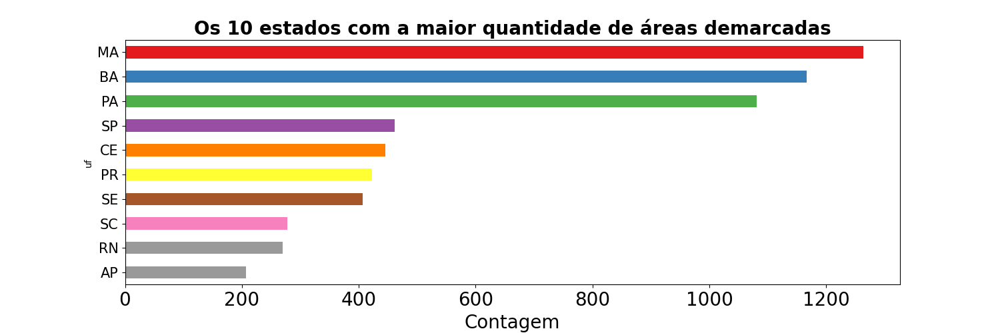
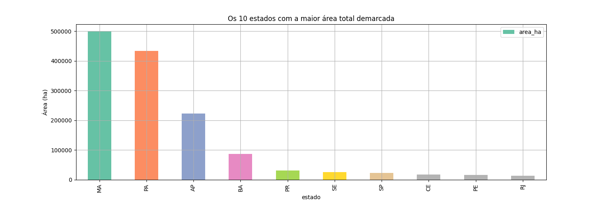
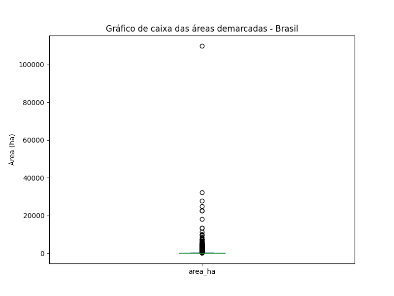
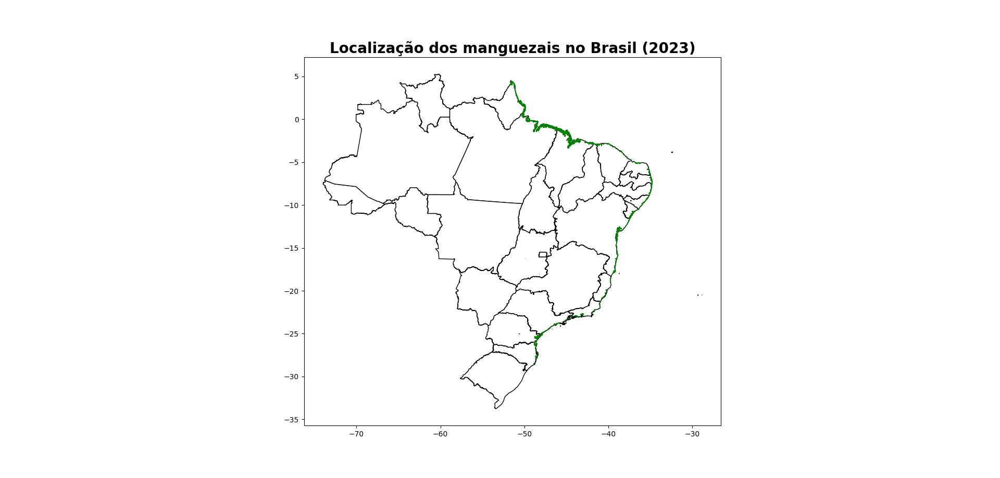
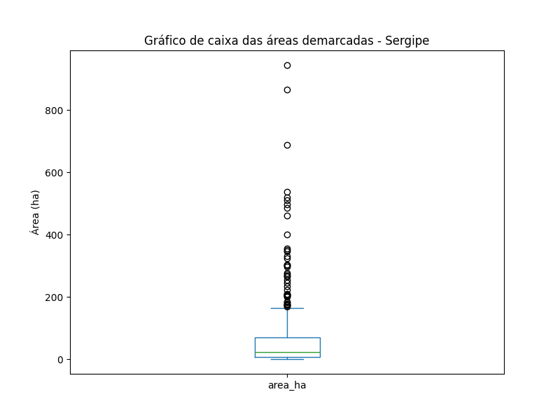
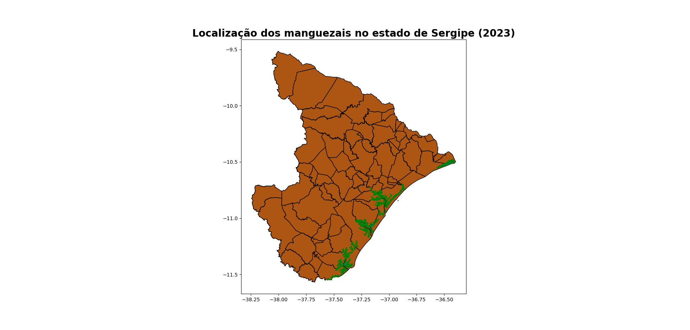

# Análise de dados geoespaciais sobre a localização de áreas demarcadas como mangues no Brasil

## Introdução

Saber a localização das áreas de preservação de mangues são extremamente importantes para a preservação delas, e para a criação de políticas públicas que auxiliem na conscientização e preservação a longo prazo, como também na recuperação de áreas que tinham as características dessa vegetação em todo o Brasil.

## Análise Geral

Com os dados geoespaciais, é perfeitamente possivel fazer uma análise deles, usando as ferramentas certas para tal trabalho. Para isso,utilizou-se a linguagem de programação <b>python</b>, juntamente com o ambiente virtual <b>jupyter notebook</b>, e as bibliotecas do python <b>geopandas</b> e <b>matplotlib</b> para a manipulação dos dados geoespaciais e geração dos gráficos, respectivamente. Então veremos os resultados abaixo:

### Contagem total de áreas demarcardas por estado

Fonte: Arquivo pessoal (2023)
 

### Soma total de áreas demarcardas por estado

Fonte: Arquivo pessoal (2023)
 

### Boxplot das áreas demarcardas - Brasil

Fonte: Arquivo pessoal (2023)
 

### Mapa das áreas demarcardas no Brasil

Fonte: Arquivo pessoal (2023)
 

### Boxplot das áreas demarcardas - Sergipe

Fonte: Arquivo pessoal (2023)
 

### Mapa das áreas demarcardas em Sergipe

Fonte: Arquivo pessoal (2023)
 

## Conclusão

Percebe-se que, com uma simples análise dos dados e sua manipulação correta, é capaz de gerar gráficos e imagens a pontos de entender a localização das áreas demarcadas como mangue no Brasil e estado de Sergipe, por exemplo. Sem contar que abre um leque de possibilidade para fazer análise mais aprofundadas ou procurar informações relevantes que ajude a elucidar algum tipo de problema. Para saber como eu fiz esses gráficos, basta acessar o <a href="https://github.com/engafs/vegetacao_mangue_br/blob/master/analise_info_mangue_br_se.ipynb">notebook</a> presente nesse repositório. Já para entender toda uma análise completa a questão geolocalização dos mangues demarcados em todo o Brasil e estado de Sergipe, basta acessar meu <a href="https://medium.com/@aristotelesfernandes11/manguezais-do-brasil-uma-janela-para-a-an%C3%A1lise-de-dados-geoespaciais-e-a-preserva%C3%A7%C3%A3o-ambiental-0d6af310994f">artigo</a> no medium.
